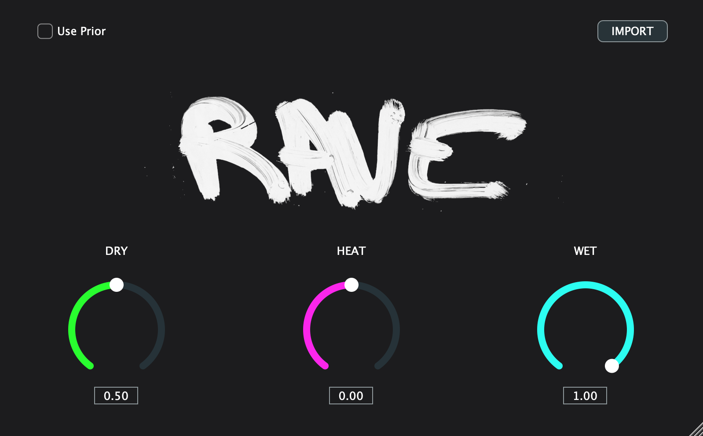

# RAVE-audition
VST/AU Plugin for Auditioning RAVE Models in Real-time

### Building the C++ project
- Add Juce 6.1.4 as a directory called JUCE in the main working directory or clone the repository.
  - `ln -s <JUCE-DIR> .`  OR
  - `git clone --depth 1 --branch 6.1.4 https://github.com/juce-framework/JUCE`
- Use cmake to build. Tested with cmake 3.21.3, clang 11.0.3, Xcode 11.7 on MacOS 10.15.7. This will download the PyTorch libraries.
  - `mkdir build; cd build`
  - `cmake .. -DCMAKE_BUILD_TYPE=Release`
  - `cmake --build . --config Release -j 4` or  `cmake -G Xcode -B build`

### Prebuilt Plugins
Coming soon!
